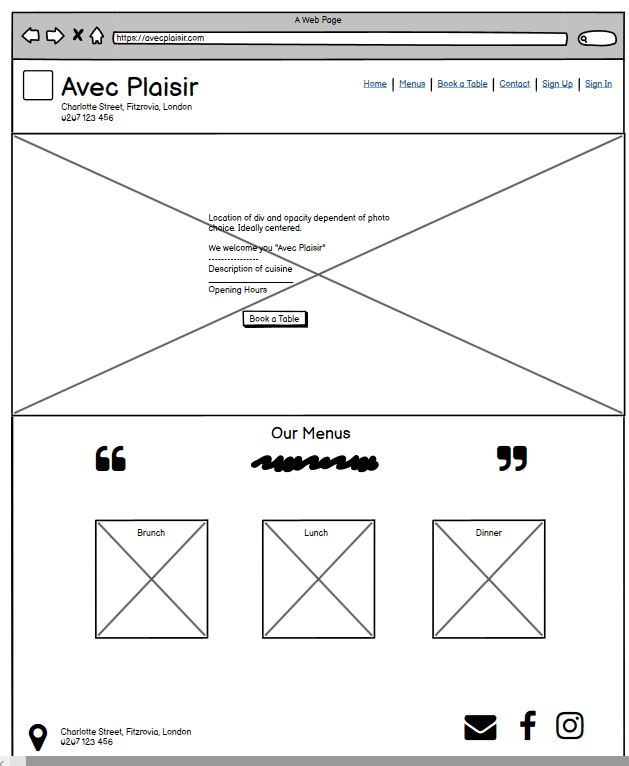
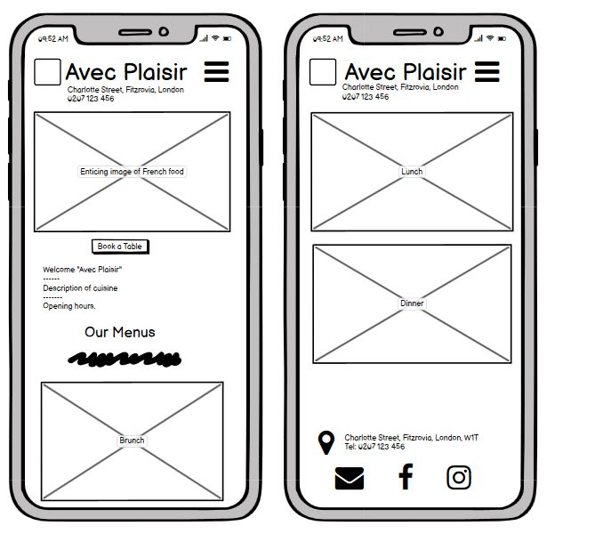
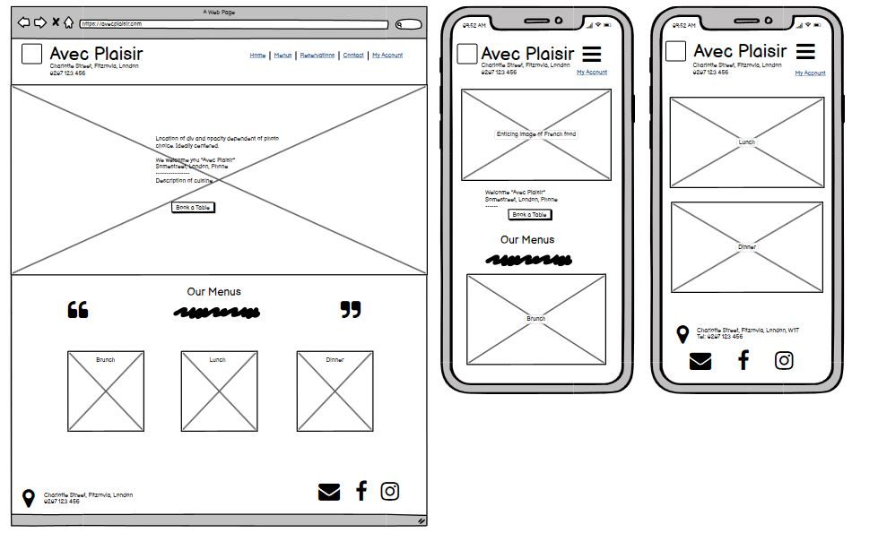
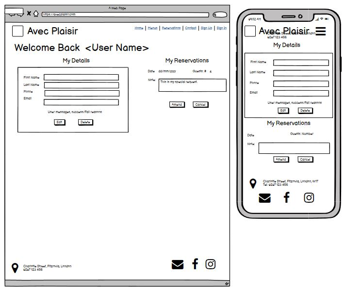
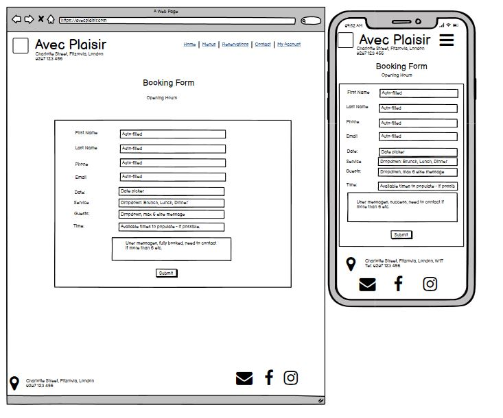

# AVEC PLAISIR

"Avec Plaisir" (With Pleasure) is a fictional French Restaurant located on Charlotte Street in London, which is a wonderful location for food lovers to enjoy food from independent restaurant owners.

The webpage was created as a restaurant management application to allow the site owner, with staff, to present their restaurant to the works and

- Take and manage bookings
- Manage menus
- Allow customers to make and manage their own bookings. 

## WEBSITE DESIGN

(REFERENCE USED - CI User Experience Essentials, "It's all about the user experience)

### The strategy plane

#### Goals

Why is the site needed? This is a website for a restaurant. The goals are to 
1. Make the restaurant look attractive.
2. Allow customers to view the menus.
3. Allow customers to make and manage a reservation.
4. Allow staff to easily make and manage their own bookings, menus and users.

#### What might drive emotional factors?
If the website looks attractive and runs efficiently, using few clicks and showing responsiveness, it is a good reflection of the restaurant's customer care and attention to detail as an overall part of the product they deliver ot customers, including the eventual food. 

#### Target Audience

The website needs to cater to  site owner, restaurant staff and customer needs.

- Site owner and Staff:
    - Where do they go first? 
        - The site owner will likely to the the admin panel first, where they can review bookings and made any edits to their menus.
    - What do you use it most for?
        - To view bookings to manage tables when customers arrive without bookings or call on the telephone and manage as appropriate.
        - To CRUD customer bookings if they call in and ask for this. 
        - To keep the restaurant menus up to date. 
    - What happens before/after using the site
        - Before:Staff most likely receive a phone call.
        - Before: Staff need to consult the bookings table to see if they can accommdate a walk-in customer.
        - After: staff members can let the kitchen know how busy the restaurant will be. 

- Customers:
    - Where do you go first?
        - The homepage as it is the main page.
    - What do you use it most for?
        - To look at the menu so I can decide if I feel like eating there.
    - What happens before/after using the site
        - Before: I've search for French restaurants in the area.
        - After: If the website is appealing and I made a booking, I'll tell my friends about it.

What are the most important features? What trade offs are needed

### Scope

Looking at the goals and use cases above, the following requirements were identified.

- Minimum requirements:
    - There must be a way to take and manage customer bookings with full CRUD.
    - The customer must be able to view the menus.
    - The customer must have information about the location of the restaurant.

- If time permits, or for future development
    - A separate contact page.
    - Email confirmations and calendar syncs.
    - Automation to delete bookings when there are no-shows.
    - Ability to edit menu items from the admin panel.

Constraints:

The main constraint is time. The project is being completed by a sole individual over 4 weeks with the Christmas holidays in the middle.

#### Agile Planning

##### Sprint 1 - 

##### Sprint 2 - 

##### Sprint 3

##### Sprint 4

### Structure Plane
#### Features/User Stories

### Skeleton Plane

#### Wireframes

Wireframes were created to envisage how user can interact with the website in order to 

- simple interaction (not too many clicks, and only include necessary features)
- allow the customer to get an overall feel for the restaurant as quickly as possible.
- allow customer to review opening hours. 
- allow customer to see restaurant location, contact information and social media links.
- allow the customer to make a booking quickly.
- to allow staff to easily review bookings.
- to allow the staff user and designated staff to manage users and permissions.

 
 ##### Homepage - PC/Larger Screens
 

 ##### Homepage - Homepage Smaller Devices

 ##### Homepage - Logged in User
 

 ##### Menu pages 
 

 ##### My Account
 

 ##### Create Account
 

 ##### Booking Form
 
 ##### Booking Success

#### Database Design

### Surface Plane

#### Design

#### Colour Palette
#### Fonts
#### Images
#### Technologies
- Balsamiq Wireframes

## Testing
## Deployment

### Early Deployment

This project was deployed as part of the project set up, as advised in the "I think therefore I blog" walkthrough. This is to ensure that our main dependenices are installed and working from the outset. From there one can build the project on a solid foundation and reduce stress at the end of the project. 

The app was deployed with Heroku, ElepantSQL and Cloudinary

#### Project set-up and deployment steps

Install Django and supporting  libraries
- Install Django
- Install Cloudinary
- Create requirements
- Create project, "avec plaisir"
- Create "home" app
- Add home app to installed settings
- Migrate changes to the DB and confirm success
- Add project to the settings
- Migrate to the database
- Run http server to check if the installation was successful

Connect to Heroku and ElephantSQL
- Create Heroku App
- Create new instance on Elephant SQL and copy DB url
- Create env.py, adding the secret key. Ensure env.py is in gitignore
- Import env.py into Settings, and edit secret key accordingly
- Comment out original databases in Settings
- Connect to ElephantSQL
- Make migrations
- Test connect to ElephantSQL was successful
- Add config vars to Heroku

Connect to Cloudinary
- Add Cloudinary API environment variable to env.py
- Add Cloudinary API environment variable to Heroku Config Vars
- Add DISABLE_COLLECTSTATIC to Heroku config vars
- In Settings,  "Installed Apps", add cloudinary_storage and cloudinary

Set up Directories and deploy
- In Settings, under STATIC_URL add STATICFILES_STORAGE = 'cloudinary_storage.storage.StaticHashedCloudinaryStorage', and add STATICFILES_DIRS, STATIC_ROOT, MEDIA_URL, DEFAULT_FILE_STORAGE
- Add Templates Directory under BASE_DIR in settings, and fill in brackets for "DIR": []
- Add Heroku host name to ALLOWED_HOSTS
- Add top level directories
- Add a procfile
- In Heroku, link to GitHub as the deployment method

## Credits
- Project planning and planes - Reviewed relevant CI lectures and and reviewed a tutorial led by Daisy McGirr on Agile Planning. I also referred to Gareth McGirr's github project/agile planning.
- Deployment steps - These were taken directly from the "I think therefore I blog" walkthrough.
