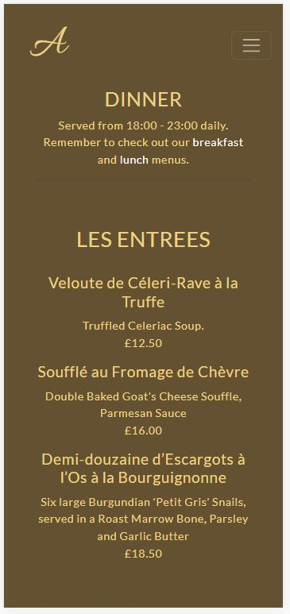
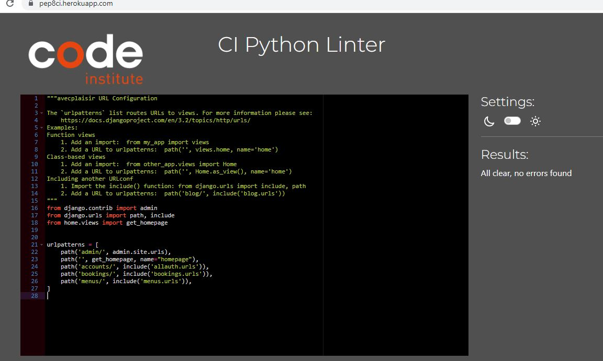

# AVEC PLAISIR

This project is a Code Institute course project requirement. You can see the deployed site [here](https://pp4-avec-plaisir.herokuapp.com/menus/menus/). 

"Avec Plaisir" (With Pleasure) is a fictional French Restaurant located on Charlotte Street in London, which is a wonderful location in London for food lovers.

The webpage was created as a restaurant management application to allow the site owner, with staff, to present their restaurant to the world and to allow customers to make and manage their reservations. Staff may also make and manage reservations via their own user profiles (like all users) or via the admin panel, with the correct permissions.

The website gives the restaurant staff an overall picture of the upcoming reservations and the assigned table. 

## Table of Contents
* [Website Design](#website-design)
    * [The Strategy Plane](#the-strategy-plane)
    * [The Scope Plane](#the-scope-plane)
        * [Agile Planning](#agile-planning)
    * [The Skeleton Plan](#skeleton-plane)
        * [Wireframes](#wireframes)
        * [Database Design](#database-design)
    * [The Surface Plane](#surface-plane)
* [Technologies](#technologies)
* [Testing](#testing)
* [Deployment](#deployment)
* [Credits](#credits)

## WEBSITE DESIGN

(The followiong section was organized use the CI tutorial, "User Experience Essentials, It's all about the user experience")

### The strategy plane

#### Goals

This is a website for a restaurant to present their restaurant and to take and manage reservations. The goals are to 
1. Make the restaurant look attractive.
2. Allow customers to view the menus.
3. Allow customers to make and manage a reservation.
4. Allow staff to easily make and manage their own bookings, menus and users.

#### Emotional factors

If the website looks attractive and runs efficiently, using few clicks and showing responsiveness, it is a good reflection of the restaurant's customer care and attention to detail as an overall part of the product they deliver.  

#### Target Audience

The website needs to cater to the site owner, restaurant staff and customer needs.

- Site owner and Staff:
    - Where do they go first? 
        - The site owner will likely to the the admin panel first, where they can review bookings and made any edits to their menus.
    - What do you use it most for?
        - To be able to view bookings and decide if tables are available for walk in customers.
        - To be able to create a reservation on behalf of the customer if they call in and ask for this. 
        - To presnt the restaurant's menus. 
    - What happens before/after using the site
        - Before:Staff most likely receive calls for reservations or walk-ins.
        - After: The restaurant has a better picture of how busy their restaurant will be in advance and the kitchen can better prepare.

- Customers:
    - Where do you go first?
        - The homepage.
    - What do you use it most for?
        - To look at the menu so I can decide if I feel like eating there.
    - What happens before/after using the site
        - Before: I've search for French restaurants in the area.
        - After: If the website is appealing and I made a booking, I'll tell my friends about it.

What are the most important features? What trade offs are needed?
- The website features are described below, but, in brief, the most important feature is the reservation booking system.
- To finish this website on time, some features I would have liked for this restaurant were not realized. For example, I would have liked to create an app that allowed staff to enter new menu items via a form, that would then dynamically update the various menus by service, menu type (starter, main, drinks, etc) and I would have liked it to be possible for the staff user to switch them on and off. I would have also liked social media login as well as a visual representation of tables in the restaurant. 

### The Scope Plane

Looking at the goals and use cases above, the following requirements were identified.

- Minimum requirements:
    - The customer must be able to sign in and sign out of the website.
    - Staff members should see a link to the admin panel when signed in, which can not be seen by non-staff users.
    - There must be a way to take and manage customer bookings with full CRUD.
    - The customer must be able to view the menus.
    - The customer must have information about the location of the restaurant.
    - The customer must have links to the address (map location), telephone number, email and social media links should be in the footer

- If time permits, or for future development
    - A separate contact page.
    - Automation to delete bookings when there are no-shows, or the reservation date is in the past.
    - Ability to edit menu items using a styled form.

Constraints:

The main constraint is time. The project is being completed by a sole individual over 4 weeks with planned travel related to the Christmas holidays in Jan, while balanced against work and family commitments.

#### Agile Planning

The project had 9 milestones. These were carried out in 3 "sprints", with some overlap. The sprints were more related to the chunks of time I had available around the Christmas holidays, work obligations and personal commitments. Therefore the sprints are not related to how much time their related tasks took but rathermore how they fit into the calendar in terms of when I had time to work on the project. 

#### Sprint 1
##### Project Set Up
- User stories related to 
    - Project Set Up and Early Deployment
    - Setting up the file structure
    - Creating the superuser login
    - Creating UX consistency by styling Django forms (This was left towards the end of the project)

##### Homepage (base.html) setup
    - Create Navbar
    - Create Footer
    - Create homepage (index.html)
    - Homepage (feature carousel)

##### Set up Admin Panel
    - I created 2 user stories here. One wasn't necessary, because I hadn't grasped how much would be out of the box with Django. The first user story was to create some user groups and give them permissions and the second was to modify the filters in the panel to show as drop down lists. This was dropped from my priority list. 

##### User Management and User Registration
I noticed late that I had two very similar milestones that should have gone into one milestone.
    - Set up Allauth
    - Create Superuser (duplicated above)
    - Nav bar links that appear when signed in
    - Sign up form for website
    - Sign up success message
    - Social Media Login (moved to won't have)
    - Forgot password (moved to won't have)
    - Customer can delete account (moved to won't have)

#### Sprint 2
##### Reservations

User stories related to the following:

    - Create reservation models
    - Customer Booking - CREATE 
    - Customer BOOKING - EDIT(Update) 
    - Customer BOOKING - LIST 
    - Customer BOOKING - DELETE
    - Reservation Logic

I had a nubmer of user stories for staff to be able to manage bookings. When I created the user stories I hadn't fully appreciated how much Django could do for me at the backend without any extra coding from me. I made notes in those user stories explaining that the admin panel already fulfilled these objectives.

#### Sprint 3
##### Menus

I unfortunately did not have time to create a new model and related views and forms to allow staff members to be able to create menu items via a form. I had originally written 5 user stories, with the priority being on customers having access to the menu on the website, but not necessarily through functionality designed to benefit staff. 

    - Create menu model - Could have
    - View menus - Must have
    - Create menu - Could hav
    - Edit menu- Could have
    - Delete menu - Could have

##### Other pages and styling
This milestone was created with the hope I'd have the time to create a separate contact page. I didn't give it priority because it is a simple site and all necessary conatact information is already in the navbar.  
    - Contact Page

#### Sprint 4
##### Final Deployment
    - Test: Fix already noted problems then test

    I tried to develop the site with unittesting, but couldn't quite get the hang of it. it was holding me back, so I created an excel spreadsheet to document the testing done on the site it self (e.g. links and form submission tests). The user story has long list of bugs to fix and a list of validators I needed to work through.  

### Structure Plane
#### Features/User Stories
Full user stories are available on the public [project board](https://github.com/users/leah-jala/projects/7/views/2). Below, I am summarizing the site's key feautures. 

##### Navigation Bar

USER BENEFIT: The user can easily navigate the site on small and large devices.  The user can see if they are signed in or not because of the links present and also because upon signing in they will have a success message. 

FEATURES:

- Navigation menu/not signed in includes the following links
    - Logo (Letter A): Links to homepage
    - Menus: links to menus.html page.
    - Book a Table: Links to reservation page (if not signed in then users are asked to sign up or sign in)
    - Sign up: Links to sign up form
    - Sign in: Links to sign in form

- Navigation Bar when signed in as a staff user:
    - The first three links are unchanged.
    - My Reservations page is now present.
    - A sign out link is present, with sign up and sign in removed.
    - A link called "Staff" brings staff to the admin panel.

- For customers, the links are as above with the omission of the "Staff Link". Note the success message in the clip.

- The nav bar is present on all pages. 

- An active link helps the user to know what page they are on as it is a different color.

##### Footer

USER BENEFIT: The user can easily find the restaurants contact information and loation. 

FEATURES:
- The footer is clearly visible on all pages.
- When viewing the site on a mobile phone, the telephone icon opens a call.
- There is a link to a google map, which opens on a new page.
- The email link opens the user's email client.
- The social media icons have been tested and lead to the relevant sites. As it is a fictional site, they lead to the homepages only. 

##### Homepage
USER BENEFIT: The homepage gives the user an overall idea of what the restaurant is about.
USER BENEFIT: As a site owner, it should be easy to make a reservation.

FEATURES:
- There is a link to book a table which is front and center.
- There is a short description about the history and ethos of the restaurant.
- The opening hours are displayed.
- Some review snippet are displayed. 
- The colors and photos help give an sense of what the atmosphere is like at the restaurant.

##### Menus
USER BENEFIT: Users need to be able to see the menus and prices to decide if they want to dine at the restaurant.

FEATURES:
- The menus landing page immediately makes clear they offer 3 services.
- Buttons are available to quickly navigate to the respective menu.
- From each menu, one can see the service hours and click on links to the other menus. 
- The simple presentation of the three menus mimics many restaurant paper menus.
- The simple presntation of the menu suits a mobile phone very well. 

##### Book a Table
- USER BENEFIT: The user can easily make a booking online.
- USER BENEFIT: Staff can make user bookings on their profiles.
- USER BENEFIT: Staff with permissions can see all bookings for all user profiles.

FEATURES
- Further information - The customer is advised to call or email if they would have a large group or need a same day reservation. 
- Party Name field - As it is not necessarily specific to the user, staff can make a reservation and take the group's name and phone number. Also, a user can list their group name in a more meaningful way, as in "Mike's Birthday Bash" or similar. Also, it would allow a user to make a booking on behalf of someone else. 
- Telephone - This field is a char field. Like this foreign numbers, mobiles, etc can be listed here. Even if there is an error, the restaurant could still contact the customer via email. 
- Date - There is a date picker, and the field will not allow users to choose a date in the past.

- Time - A dropdown list with the available time slots.
- A dropdown list (limited to 8)
- Special requests - A text area where a customer could ask a question or notificy the restaurant about things like allergies or wheelchair access.
- The Name, Date, Time and Number of Guests are required fields, ensuring the restaurant has all the information they need. 

- The booking system takes into account the restaurants capacity, so the user can not book an unavailable table. 

- Once the user clicks the "Book It" button they are brought to My Reservations page where they can see the booking they just made along with any others. There is also a success message at the top of the page.

##### My Reservations
USER BENEFIT: As a user, I need to be able to manage my reservations.
USER BENEFTI: As a site owner, I want my clients to be able to manage their own bookings for their own ease but also to free up staff time. 

FEATURES
- When a customer is signed in, they can see any reservations they've made, listed in date order, and edit or delete them (image above). 
- A success message is given when they update or edit their reservation.

- The booking system takes into account the restaurants capacity, so the user can not book an unavailable table. 
- When the user wants to delete a booking, they can do so by clicking the "delete" button. It will ask they user if they are certain, then if they continue they will get a success message. If they cancel, they return to "My Reservations". 

##### Forms and Django forms

USER BENEFIT: As a site owner, I want my website to look uniform and professional.

FEATURES:

- The site makes use of Django's built in features, including the sign in and sign out forms. These have been uploadeed into the project and styled to match the rest of the website.
- The project use's crispy forms and Bootstrap for consistency and for a clean presentation.

##### Error Pages and site security

USER BENEFIT: As a site owner, I want my site to be secure.

FEATURES
- 403, 404 and 500 error pages have been added to the project. For example, if the user writes the URL form incorrectly they will get a Page Not Found/404 page that is styled to match the site and a button to return home.

- If a user that is not signed in tries to access the admin panel, they will be directed to the Django admin login form.

- If a signed in suer tries to access the admin login form. They will be directed to the admin panel and told they don't have access. 

- If a user types in another user's reservation number into a URL, they will be refused access and led to a styled 403 page. This was accomplieshed with the UserPassesTestMixin

The 500 error pages appears when there is an internal server error, which tells users there is a problem with the website.

### Skeleton Plane

#### Wireframes

Wireframes were created to envisage how user can interact with the website, with a view to:

- simple interaction (not too many clicks, and only include necessary features)
- allow the customer to get an overall feel for the restaurant as quickly as possible.
- allow customer to review opening hours. 
- allow customer to see restaurant location, contact information and social media links.
- allow the customer to make a booking quickly.
- to allow customer to update or delete their booking.

 
 ##### Homepage
 

 ##### Menu landing page, and service menus 
 
 

 ##### Booking Form
 
 
 ##### My Reservations
 

#### Database Design & Logic

The project reservation app has 2 tables. The reservations table contains the following fields:

- Guest Name
- Phone Number
- Reservatinon Date
- Reservation Time
- Number of Guests
- Booked Table (The logic in the views makes this assignment)
- Special Requestions
- Last Updated (This is for the benefit of staff users when using the admin panel)

The "Tables" table contains the following fields:
- Table ID
- Table Size
- Minimum (reference to the table's capacity)
- Maximum (reference to the table's capacity)

When a customer makes a booking, the logic of the code does the following:
    - It converts the date into datetime and checks it against today's date. It does not allow a booking for today's date, or a date in the past.
    - It filters the reservations table for tables already booked at the requested time.
    - It creates a filtered list of table IDs of the size requestd and removes already booked tables from the list 
    - From what's remaining on the list, it assigns the first table on the list and adds it to the reservation table. 
    - If no tables are available, it gives the user an error message. 

### Surface Plane

#### Design

#### Colour Palette

I began by choosing a photo that matched the idea I had for the restaurant and using the color picker on Google Chrome to select colors from the image.

The background color is # #645132 and the fonts are #efd485. With these colors, I was trying to give the impression of coffee and creme brulee, which a lot of people associate as warm nice things, and also with French food and drink.

I had to add an overlay to the hero image in order to give enough contrast with the font color. 

#### Fonts

I have used Google fonts. The restaurant name and logo uses Allura, and the rest of the site uses Lato and defaults to sans-serif.

#### Images

My images are free images available on Pexels.com.  Credits below.

## Technologies
- HTML - Site structure
- Bootstrap - Used for most of the styling.
- CSS - to override some Bootstrap classes and add additional styling.
- Javascript - for the datepicker and the active class on the navbar.
- Google Fonts - The Allura and Lato fonts
- Font Awesome - for all icons
- Balsamiq Wireframes - for initial site design
- [Cloud Convert](https://cloudconvert.com/jpg-to-webp) - to convert files to from jpegs to webp.
- [Favicon.io](https://favicon.io/favicon-generator/) - to create the site's favicon
- [autopep8](https://pypi.org/project/autopep8/) - to force pep9 conformity to code from command line.
- [Crispy forms](https://django-crispy-forms.readthedocs.io/en/latest/) - to control the rendering behaviour of django forms.
- CI Python Linter
- WC3 [HTML Validator](https://validator.w3.org/) and [CSS Validator](https://jigsaw.w3.org/css-validator/)
- [JSHint](https://jshint.com/)
- [GitHub](https://github.com/leah-jala/PP4-Avec-Plaisir) - to host source code
- Git - to commit and push code
- GitPod - The IDE used to develop the site
- [Heroku](https://dashboard.heroku.com/apps) - PaaS used for deployment
- [Cloudinary](https://cloudinary.com/) - To host images.
- [ElephantSQL](https://www.elephantsql.com/) - PostgreSQL databases

## Testing and bugs

## Website testing
All tests have been documented in a spreadsheet. The link will be made to the project assessors. Screenshots are below.

## HTML validator 
### Homepage

### Menus

### Book a Table
Menus landing page

Breakfast menu

The lunch and dinner pages were checked, but not added here as they are nearly identical. 

### My Reservations

### Sign in / up / out
Sign in

Sign up

### Sign out and error pages

These were also tested but is not included here as snippets. These forms are mostly a test of my base.html.

## CSS validator
No errors found

## Python validator
CI Python Linter
### avecplaisir-settings.py
Note: After getting advice from my mentor on how to fix the default Django settings by adding a ' and moving the text to a new line, the settings.py file passed the pep8 test, and it seemed to deploy, but later when I updated my readme file, it didn't deploy. I changed the settings back, and then it deployed successfully. I've left it with some lines too long. 
 

### avecplaisir-urls.py

### Bookings/views.py

### Bookings/admin.py

### Bookings/models.py

### Bookings/urls.py

### Menus-views.py

### Menus-urls.py

## JS validator

The Datepicker and active class included together

## Lighthouse

It was a mistake not to put the datepicker javascript script into a separate file or on the pages required only, as it affected page performance stats.

### Homepage
Desktop

Small Screen

### Menus
Desktop

Small Screen

Breakfast - Desktop

Breakfast - Small Screen

Lunch - Small Screen

Dinner - Large Screen

### Book a Table
Desktop

Small Screen

### My Rerservations
Desktop

Small Screen

### Sign up/in/out
They are almost identical so one set provided
Sign-up Large Screen

Sign-up Small Screen

### Bugs/Fixes and Problems to resolve in future updates
- When running the html checker I discovered that some of my cdns were risky or to be deprecated, so I needed to update them. This related to the Datepicker and JQuery.
- DRY principle in logic: I realized late that I did not include my reservation logic in my edit(update) view, but only the CreateReservationView. I think because I was hurried, nothing seemed to work. I tried to move the logic to the form.py file, but this didn't work. I tried to create a definition that both views could call upon and this didn't work. I need to do more research on this, but my mentor sugggested I should put the logic into a separate python file and import it into the views. 
- It was a mistake to put the javascript short scripts into the base.html file, as not all pages needed the datepicker. In future, I would include it only in the files where they are needed. I should have made a base form for the reservation pages (booking form page and my reservations list)
- Phone field:  My phone number field was originally too restrictive and only would accept US number. I tried different solutions, but ran out of time. For example, I tried to add a country code drop down, and 
 I can see it is possible to default it to a specific country code, but that didn't work for me. I tried to 
 handle the exception so that users could be given advice on how to enter a number correctly, as it did automatically by Django, but this wasn't working either. I opted to make it a charfield and not required. As the user has to be signed in to make a reservation, it would still be possible for the restaurant to get in touch about the booking. It is not ideal and it is something I would fix later. 
- myReservations.html - The header in the form used the users first_name, but you are not required to enter a first name when you sign up. I added a fiter to the html so that it would use the first name if it is there and otherwise use the username.
- Footer inconsistency - The footer isn't completely consistent on larger screens. On the sign in and out pages it sits under the content in the middle of the page and the body background continues under it. 

## Future updates
These are the things I would improve with an update:
- It was a mistake to put the datepicker Javascript in the base.html file. In and upgrade, I would confine it to the files for which it is needed via an import.
- Refactor the bookings/views.py document so that it follows the DRY principle.
- Create the form so immediate feedback is given as the user enters data into form field so they know the information they've entered is correct.
- Change the guest number and time fields on the reservation form so that they are not pre-filled and so they are validated to prevent the user from forgetting this field.
- Make the special requests field appear only if they have filled it in. 
- Create a more complex menus app so that staff users could enter new meals via a form, and indicate if it should be active (included on the menu), which service it should be part of, and what type of menu item it is (starter, main, dessert, etc).

## Unittesting
I was doing something wrong, perhaps at the command line. The tests wouldn't run at all. It was holding me back, and because it wasn't required to pass this project, I put it aside so I could keep going. It was a pity because I could see the benefit. If you make a resesrvation, you'll see that the reservation numbers are now over 100, which means I have created and updated that many in order to test my website, which is a waste of time. The tests that should have been unit tests are in the excel file.

## Deployment
### Early Deployment

This project was deployed as part of the project set up, as advised in the "I think therefore I blog" walkthrough. This is to ensure that our main dependenices are installed and working from the outset. From there one can build the project on a solid foundation and reduce stress at the end of the project. 

The app was deployed with Heroku, ElepantSQL and Cloudinary

#### Project set-up and deployment steps

Install Django and supporting  libraries
- Install Django
- Install Cloudinary
- Create requirements
- Create project, "avec plaisir"
- Create "home" app
- Add home app to installed settings
- Migrate changes to the DB and confirm success
- Add project to the settings
- Migrate to the database
- Run http server to check if the installation was successful

Connect to Heroku and ElephantSQL
- Create Heroku App
- Create new instance on Elephant SQL and copy DB url
- Create env.py, adding the secret key. Ensure env.py is in gitignore
- Import env.py into Settings, and edit secret key accordingly
- Comment out original databases in Settings
- Connect to ElephantSQL
- Make migrations
- Test connect to ElephantSQL was successful
- Add config vars to Heroku

Connect to Cloudinary
- Add Cloudinary API environment variable to env.py
- Add Cloudinary API environment variable to Heroku Config Vars
- Add DISABLE_COLLECTSTATIC to Heroku config vars
- In Settings,  "Installed Apps", add cloudinary_storage and cloudinary

Set up Directories and deploy
- In Settings, under STATIC_URL add STATICFILES_STORAGE = 'cloudinary_storage.storage.StaticHashedCloudinaryStorage', and add STATICFILES_DIRS, STATIC_ROOT, MEDIA_URL, DEFAULT_FILE_STORAGE
- Add Templates Directory under BASE_DIR in settings, and fill in brackets for "DIR": []
- Add Heroku host name to ALLOWED_HOSTS
- Add top level directories
- Add a procfile
- In Heroku, link to GitHub as the deployment method

#### Final deployment

- In settings, 
    - Set DEBUG to False. If this is not done, cloudinary images won't be served and traceback error messages will be shown to the user (which can also reveal credentials that can benefit hackers).
- Update Heroku configuration settings. Remove CollectStatic.
    
## Credits and Sources
- My course mentor, Daisy McGirr, was as always a fabulous guide through the project as well as a source of encouragement.
- Project planning and planes - Reviewed relevant CI lectures and and reviewed a tutorial led by Daisy McGirr on Agile Planning. I also referred to Gareth McGirr's github project for the agile planning. I did not refer to his project for the rest of my project development. In the beginning, I simply felt out of my depth and couldn't even understand his project, but additionally, I wanted to do it on my own. When I go to improve mine, I plan to have a closer look at his work. I did refer to his readme file to put together this file.
- Deployment steps - These were taken directly from the "I think therefore I blog" walkthrough.
- Datepicker - https://simpleisbetterthancomplex.com/tutorial/2019/01/03/how-to-use-date-picker-with-django.html, updated at https://cdnjs.com/libraries/datepicker
- Photos from Pexels.com
    - Hero Photo by Pixabay: https://www.pexels.com/photo/alcohol-architecture-bar-beer-260922/
    - Breakfast photo by Emrah Tolu: https://www.pexels.com/photo/fried-egg-beside-bread-platter-2662875/
    - Lunch Photo by Pixabay: https://www.pexels.com/photo/blur-breakfast-chef-cooking-262978/
    - Dinner photo by Elina Sazonova: https://www.pexels.com/photo/woman-holding-wine-glass-selective-focus-photography-1850595/
    - Wine bottles: Stanislav Kondratiev
- Built-in template flags and filters https://docs.djangoproject.com/en/4.1/ref/templates/builtins/
<!-- https://stackoverflow.com/questions/35427641/how-to-dynamically-set-the-active-class-in-bootstrap-navbar -->

## Sources for future
- Django allauth social login - https://django-allauth.readthedocs.io/en/latest/providers.html#google
